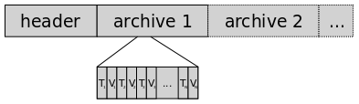

#Graphite

Chris Davis

Graphite[1](#fn1)只做两件很简单的事情：存储随着时间变化的指标数值，然后对其进行图形化。其实，近几年来，有许多软件在做同样的事情。Graphite的独特之处就在于，它将这一功能作为一种既好用又可扩展的网络服务来提供。向Graphite发送数据的协议相当简单，你可以在几分钟之内就上手（也许不是你真想要的，不过确实是对其简单性的一种验证）。Graphite对图形的渲染和对数据点的检索，就像获取URL那样容易。这一点让Graphite可以很自然地跟其它软件进行集成，最终用户从而可以基于Graphite构建功能强大的应用。一种最常见的Graphite应用就是构建基于web的监测和分析仪表板。Graphite诞生于一个大量电子商务的环境，它的设计也反映了这一点。可扩展性和对数据的实时访问是关键目标。

使Graphite达成上述目标的几个组件包括：特殊设计的数据库和存储格式，用来优化I/O操作的缓存机制，以及简单而有效的服务器集群方法。这里不仅要描述Graphite今天是怎样工作的，我还要解释Graphite最初是怎么样实现的，我曾经遇到过哪些问题，然后我又是怎么找到解决方法的。

##8.1. 数据库类库：存储时间序列数据

Graphite完全由Python写成，包括了三个部分：数据库类库whisper，后台守护进程carbon，和前端提供图形渲染和简单UI的webapp。whisper专门为Graphite所写，亦能被单独使用。设计上它和RDDtool所使用的循环数据库很类似，并只存储时间序列数据。通常我们都认为数据库是服务器端的进程，而客户端应用通过socket与之对话。然而，whisper更像RDDtool，它是一种数据库类库，应用程序用它操作和检索存储在特定格式文件里的数据。最基本的whisper操作是：creat-创建一个新whisper文件，update-往文件里写入新的数据点，和fetch-检索数据点。

图8.1 whisper文件的基本框架

如[图8.1](#figure81)所示，whisper文件以含有多种元数据的头部（header）开始，后面紧接着是一个或者多个存档（archive）段。每一个存档段都是一串（时间标记-timestamp，数值-value）成对儿形式的连续数据点。当执行update或者fetch操作的时候，whisper会根据存档设置和时标，确定被读写数据在文件内的位置偏移量。

##8.2. 后端：简单的存储服务
Graphite的后端是一个叫carbon-cache的守护进程（deamon），通常简化作carbon。它基于Twisted构建，Twisted是Python的一个高伸缩性事件驱动I/O框架。Twisted使得carbon可以高效地同大量的客户端对话，并且以较低开销处理大的流量。[图8.2](#figure82)展示的是carbon，whisper和webapp之间的数据流：客户端应用收集数据，并送往Graphite后端，carbon然后利用whisper来存储这些数据。这些数据之后可以被Gaphite的webapp生成图形。

图8.2 数据流

carbon的首要功能就是按照客户端提供的指标（metric）存储数据点。在Graphite的术语里，指标（metric）指任何随时间变化的可测量的数值量（比如一台服务器的CPU利用率，或者某产品的销售数量）。数据点就是一个简单的（时标，值）对儿，它代表了在某个时间点，测量特定的指标所得的值。指标的名字独特而唯一，这些名字和数据点一样都是由客户端应用提供的。一种常见的应用形式就是监控代理，它一面收集系统应用的指标，同时把收集到的数值发送到carbon进行存储和可视化。Graphite之中的指标采用简单的层级命名法，就像文件系统的路径那样，只不过用点`.`取代了斜线`/`或反斜线`\`符号。carbon认同任何合法的命名，并为每个指标创建一个whisper文件来存储数据点。这些whisper文件存储于carbon的数据目录下，文件的路径名和点分的指标名相对应，举例来说，`servers.www01.cpuUsage` 对应 `…/servers/www01/cpuUsage.wsp`。

当客户应用想要发送数据给Graphite时，它必须建立一个TCP连接到carbon，通常使用2003端口[2](#fn2)。会话的过程完全是客户端在用，carbon不会向连接发送任何东西。客户端以纯文本格式发送数据点，期间会需要打开连接或者按需重用。数据的格式是这样的，每行表示一个数据点，它包含：指标名称，值，和一个unix时标，它们之间用空格来分隔。举个例子，客户端会发送：

    servers.www01.cpuUsage 42 1286269200  
    products.snake-oil.salesPerMinute 123 1286269200  
    [一分钟之后]  
    servers.www01.cpuUsageUser 44 1286269260  
    products.snake-oil.salesPerMinute 119 1286269260

概括来说，carbon所做的事情就是按这种格式收听数据，并尝试将数据通过whisper尽快地存储在磁盘上。稍后我们会讨论一些保证可伸缩性的精巧细节，以及如何从一个典型的硬盘上获得最好的性能。

##8.3. 前端：按需制图
Graphite的webapp前端使用简单的基于URL的API请求定制图形。绘图的参数被置于HTTP GET请求的查询字串中，而返回的是PNG格式的图片。例如，URL：

    http://graphite.example.com/render?target=servers.www01.cpuUsage&width=500&height=300&from=-24h

请求了指标`servers.www01.cpuUsage`过去24小时数据的一幅500x300的图形。实际上只有`taget`参数是必须的，所有其它参数都是可选的，如果你忽略它们，就会用缺省值。

Graphite支持一组广泛的显示选项，同时也支持简单语法的数据操作函数。例如，我们可以这样来绘制前面例子中指标的十点移动平均图：

    target=movingAverage(servers.www01.cpuUsage,10)

函数可以嵌套，从而允许更复杂的表达式和计算。这里有另外一个例子，它能给出每产品每分钟销售的运营中全天汇总：

    target=integral(sumSeries(products.*.salesPerMinute))&amp;from=midnight

其中`sumSeries`函数可以计算出每个匹配`products.*.salesPerMinute`模式的指标总和的时间序列。`integral`函数计算运营中的汇总，而不是每分钟的计数。这里不难想象用户会如何构建他们的web UI来展示和操作图形。Graphite带有它自己的设计者UI，见[图8.3](#figure83)，当使用者点击可用特性的菜单，它便会用javascript来改变图形请求URL的参数。

图8.3：Graphite的设计者UI

##8.4. 仪表板

自Graphite创立之初就被当做一个创建web仪表板的工具。它的URL API让这点成为自然的用例。建造一个仪表板可以简化成建造布满类似下面标签的HTML页面：

    

尽管如此，不是每个人都喜欢手工构建这些URL，因此Graphite的设计者UI提供了一种“点-选”（point-and-click）方法来构建图形，而你只需要简单的复制和粘贴URL。当与另外一种网页快速构建工具（比如wiki）协同工作的时候，这一特性就简单到那些非技术用户也可以轻松构建它们的仪表板。

##8.5. 明显的瓶颈

曾经，一个用户构建它的仪表板，Graphite很快就开始遇到性能问题。我研究了web服务器日志，想看看哪些请求拉低了性能。问题很明显，就是绘图请求的绝对数量太多。webapp占满了CPU，不停的在渲染图形。我注意到有很多重复的请求，仪表板显然有问题。想象你有一个10幅图的仪表板页面在每分钟刷新。每当一个用户用浏览器打开仪表板的时候，Graphite每分钟就得处理十多个请求。这很快就会变成昂贵的开销。

一种简单的解决方法就是每张图只渲染一次，然后将它的副本送给每个用户。Django web框架（Graphite基于此构建）提供了一种优秀的缓存机制，可以利用多种后台缓存技术，比如memcached。Memcached[3](#fn3)是一种基础的哈希表网络服务。客户端的应用可以像传统哈希表那样存取键值对儿。用memcached的主要好处就是把高开销请求（比如图形渲染）的结果暂存起来，供后续的请求检索。为了避免总是返回过期的图片，memcached可以为缓存的图形配置较短的有效时间。尽管可能只是几秒钟之短，它也能为Graphite显著减压，因为重复的请求实在太常见了。

另一个产生过多渲染请求的情形是当用户通过设计者UI调整显示选项和使用函数的时候。每当用户改变一些设置，Graphite就必须重画图形。相同的数据被多次请求，所以它们理应也加入缓存。这样一来，检索数据的步骤可以跳过，UI对用户请求的响应便会更及时。

##8.6. 优化I/O

试想你有60,000个指标要送给你的Graphite服务器，它们每分钟会产生一个数据点。记着，每个指标在文件系统上都有它自己的whisper文件。这意味着carbon每分钟必须对60,000个不同文件进行写操作。由于carbon可以毫秒级的速度写文件，所以还来得及。至此一切还算不错，但是让我们假设你有600,000个指标，每分钟更新，或者你的指标需要每秒更新，亦或者你负担不起更快的存储配件。不论哪种情况，假设数据点到达的速率超过了往存储上面写操作能赶得上的速率。这种情况将如何是好？

当前大部分的硬盘寻道时间相对较慢[4](#fn4)，即在两个不同位置进行I/O操作的时间相比于连续位置写入顺序数据的时间。这意味着我们只要写入更多的连续数据，就会获得更高的吞吐率。不过，如果我们有上千的文件需要经常写入，每次写的数据量又很少（一个whisper数据点只有12字节），那么硬盘一定会在寻道上浪费大部分时间。

这种写入操作的速率有较低天花板的情形下，唯一能提高数据吞吐量的方法就是一次写操作完成多个数据点的写入。这是可行的，因为whisper会安排相连的数据连续写入磁盘。所以我给whisper增加了一个`update_many`功能，它能把单一指标的一系列连续的数据点合并为一次写操作。尽管这样每次写入的数据量会变大，但是写入十个数据点（120字节）的时间相比一个数据点（12字节）差别并不大。只有当每次写入的数据点数量多到一定程度的时候才会引起显著的时间延迟。

接着我在carbon内实现了一个缓冲机制。每个到来的数据点都依它们的指标名映射并附加到一个队列。另外一个线程反复的轮询所有的队列，然后把这些数据点取出队列，利用`update_many`写入到相应的whisper文件。回到我们刚才的例子，如果我们每分钟有600,000个指标要更新，而我们的存储只能做到每毫秒写入一次的话，那么最终每个队列平均将有十个数据点。而这仅消耗内存资源，由于每个数据点仅占几个字节，相对来说是充足的。

当数据点的到达速率超出你存储的I/O操作速率，这一策略能动态地缓冲必要多的数据点。这种方式的一点好处就是，为处理暂时性的I/O减慢增加弹性。如果系统在除了Graphite之外需要进行I/O操作，那么写操作的速度就会下降，此时carbon队列就会增长。队列越长，写也越长。由于整体的数据点吞吐率等同于平均写入速率乘上每次写的数据平均大小，只要队列有足够的内存，carbon就能跟得上。carbon的排队机制见[图8.4](#figure84)

图8.4 carbon的排队机制

##8.7. 保持实时性

缓冲数据点是个不错的优化carbon I/O之法，可是好景不长，我的用户们发现了另一种麻烦的副作用。重新审视我们的例子，当我们每分钟需要更新600,000个指标，我们假设，存储可以每分钟写操作60,000次。这意味着，在carbon队列里，随时都缓存着大约十分钟的数据。这对于用户来说，每当他们通过Graphite的webapp请求图形时，会漏掉最近十分钟的数据，这可不好！

幸运的是，这个问题可以直截了当地解决。我给carbon加上一个socket listener，它提供对缓冲队列中数据的查询接口，然后我又修改了Graphite webapp，让请求数据的时候使用这个接口。这样，webapp就可以从carbon获得硬盘和内存数据的组合，图形也就实时了。

诚然，例子中，数据是按分钟来更新的，所以并不是严格的“实时”，不过只要数据点被carbon收到，所请求的图形就有即时的更新。

##8.8. 内核，缓存和灾难性失败

也许现在很明显了，一个系统性能的关键特性，就是Graphite的性能取决于I/O延迟。到目前为止，我们都假定我们的系统始终拥有低I/O延迟，平均每次写在1毫秒完成，但这是一个很大的假设，我们需要深入一点的分析。大多数硬盘不快；甚至很可能对于有几十个磁盘的RAID阵列，随机访问时间都会超过1毫秒延迟。但如果你想测试到底多快，你会发现，将1K字节到磁盘，连旧笔记本电脑的写系统调用都在远小于1毫秒内返回。为什么呢？

当软件具有与设计不一致的或非预期的性能特点，通常缓冲或高速缓存是罪魁祸首。在这种情况下，我们都得要处理。写系统调用不直接写数据到磁盘上，它只是把数据放在一个内核的缓冲区，稍后一并写入磁盘。这就是为什么写调用通常很快返回的原因。即使缓冲区的数据已经被写入了磁盘，它往往也会被保留在缓存，以便后续读取操作使用。这两种行为，缓冲和缓存，当然是需要内存。

内核的开发者，一帮聪明人，觉得使用用户空间的空闲内存，而不是分配额外内存，绝对是个好主意。这是一个非常有用的性能助推器，这也解释了为什么你无论给系统加多少内存，通常会在一定量的I/O操作后，“空闲”内存都所剩无几。如果你的用户空间应用程序不使用，那么内核也很可能会用。这种方法的缺点是，当用户空间的应用想要为自身分配更多的内存时，这些“空闲”内存就可能被从内核拿走。同时内核也不得不放弃，并失去已有的缓冲区。

那么这一切对Graphite意味着什么呢？我们仅强调了carbon的可靠性依赖于I/O持续的低延时，同时我们也知道，写系统调用所谓的迅速返回，只不过是把数据复制到了缓冲区。那么，如果内核没有足够多的内存来作为写入缓冲区，会怎样呢？此时写操作就会变成巨慢的同步方式。这会让carbon的写操作速率急剧下降，导致carbon的队列增长，进而消耗更多的内存造成内核更加吃紧。最终，此种情形会导致carbon运行内存耗尽，或者被已激怒的系统管理员杀掉。

为了避免这种灾难，我给carbon添加了一些特性，包括可配置的队列中数据点容量的限制，各whisper可以多快执行操作的速率限制。这些功能可以保护carbon不至失控，而是换之以相对不那么糟糕的情形，如丢弃数据点或者拒绝接受更多数据点。然而，对于那些设置，合适的值是系统特定的，需要进行大量的试验来调整。它们是有用的，但它们不从根本上解决问题。为此，我们需要的是更多的硬件。

##8.9. 集群

要让多台Graphite服务器从用户的角度看上去就像一台一样，并不是那么困难。webapp的用户交互主要是两种操作：查找指标和获取数据点（通常是图形）。webapp的查询和获取操作，被从其它的代码库中抽取出来，单独打包于另外的库里，并且通过HTTP的请求处理方法暴露出来，方便远程调用。

`find`操作在本地文件系统上查找和用户指定模式匹配的whisper文件数据，就像文件系统`glob`那些匹配*.txt的文件。作为树型结构，`find`操作的结果是`Node`对象的集合，每一个都派生于主干或叶子`Node`的子类。目录对应于主干节点，whisper文件对应于叶子节点。这一层的抽象简化对不同类型底层存储的支持，包括RRD文件[5](#fn5)和压缩的whisper文件。

`Leaf`接口定义了`fetch`方法，实现则取决于叶节点的具体类型。对于whisper文件，它只是在whisper库自身的`fetch`函数上面简单包了一层。当加上了对集群的支持，`find`函数被扩展为可以通过HTTP请求对webapp配置的其它Graphite服务器进行远程`find`调用。这些HTTP请求返回的节点数据被包装在`RemoteNode`对象中，它符合通常的`Node`，`Branch`和`Leaf`接口。这让集群化对剩余的webapp代码透明。对远程叶子节点的`fetch`方法被实现成另外一个向该叶子节点所在的Graphite服务器发起的HTTP调用。

所有这些webapp间的调用，就跟客户端程序调用它们的方式一样，除非操作中有特别参数指定该操作必须在本地执行且不得转发至集群。当webapp收到渲染图形的请求，它先执行`find`定位被请求的指标，然后调用`fetch`检出数据点。这一操作不限定数据是在本地，远端服务器或者都有。如果一台服务器宕机，远程调用会很快超时，然后它就被标记成“不可用”一小段时间，这样就不会再有对它的调用了。从用户的角度看，那台失去的服务器上面的数据点在图形里就没有了，除非这些数据也存在集群里面的另外一台服务器上。

##8.9.1. 集群效率的简要分析

渲染是图形请求最昂贵的环节。每次渲染都是由单一服务器进行，所以添加更多的服务器会有效提高图形渲染能力。然而，事实上，许多请求最后会分配`find`调用到集群中的其它服务器上，这意味着我们的集群方案是共享前端负载而不是分散它。目前，我们在这一点上所做的，都是分担后端负载的有效方法，即每个carbon实例独立运行。这是一个很好的第一步，因为大多数时候后端相较之于前端，会更早成为瓶颈，但显然前端不能用这种横向方法扩展规模。

为了使前端更为有效地扩展规模，webapp的远程`find`调用必须减少。再一次，最简单的方法还是缓存。正如memcached已经用于缓存数据点和渲染图，它也可以被用来缓存`find`请求的结果。由于指标的位置不太可能经常发生变化，通常应该被缓存更长的时间。作为给`find`的结果设置超长超时限制的代价，就是当指标层次中增加了新的指标，它们不可能被迅速地呈现给用户。

##8.9.2. 分布指标于集群

Graphite的webapp在集群中是均匀的，也就是在每台服务器上都跑相同的任务。然而carbon的角色，在不同服务器上可以是不同的，这取决于你选择向每个实例发什么样的数据。通常有许多不同的客户端向carbon发送数据，所以，如果要让每个客户端的配置和你的Graphite集群布局发生偶合是相当讨厌的事。应用的指标可能被送到一个carbon服务器，而业务指标，则会被送到多个服务器做冗余备份。

为了简化对这种情景的管理，Graphite附带了一个叫做carbon-relay的工具。它干的活儿相当简单，完全像carbon守护进程（实际名称carbon-cache）那样从客户端接收指标数据，不过它不存储数据，而是对指标名称应用一套规则，来决定该向哪一个carbon-cache服务器传递数据。每个规则包含一个正则表达式和一个目标服务器的列表。每当收到数据点，这些规则就被按顺序地启用，直到第一个正则表达式和指标名相匹配。这样一来，客户端要做的，是把它们的数据发给carbon-relay，而它便会交给正确的服务器。

在某种意义上carbon-relay提供了复制（replication）功能，不过这个更准确的应该叫做复本（duplication），因为它并不处理同步问题。如果有一台服务器短暂失效，它就会漏掉这期间的数据点，其它时间则会工作正常。有一些系统管理脚本，可以把重新同步这个过程的控制交给系统管理员来负责。

##8.10. 设计之反思

在Graphite上的经验再一次坚定了我的一个信念，规模和低性能关系甚微，反而是系统的整体设计起作用更大。我曾几度遇到瓶颈问题，但是每次我都会通过改进设计来寻求性能改善，而不是通过加速。我曾经被多次问到，为什么要用Python而不是Java或C++来写Graphite，我的回答总是，还没遇到真正需要另一语言性能优势的情形。在[[Knu74]()]里面，Donald Knuth的著名论断是，不成熟的优化是一切罪恶的根源。既然我们假定我们的代码将一直会不平凡的发展下去，那么一切优化[6](#fn6)都带有那么一点“不成熟”的感觉。

一个Graphite最大的优点，也是最大的缺点，就是实际上它没多少是用传统意义上的方法“设计出来的”。Graphite一步步走来，跨过困难，成长壮大。许多次，可预见的跨越和各种先入为主的解决方案看上去好像很自然。不管怎样，它帮助避免陷入你还没有碰到的问题，即使这问题好像你马上就会碰到。原因是你通过研究真实的失败案例，可以比理论上的高级策略学到更多。问题的解决同时被我们手上的经验数据和我们自己的知识及直觉推动。我发现，对自己智慧的足够质疑，可以迫使你更深入的审视自己的经验数据。

举例来说，当我刚开始写whisper，我坚信将来为了速度必须要用C重写，Python只是原型实现。如果不是时间紧迫，我想我会完全跳过Python实现。然而，实际上I/O比CPU更早的成为瓶颈，Python略低的效率实际上根本没啥机会发作。

我说过，这样的渐进发展也是Graphite的一个巨大弱点。接口，对渐进式的发展来说，表现得并不好。好的接口，应该保持一致性，用惯例来最大化可预见性。按这一标准，我认为Graphite的URL API有点矬。选项和函数经常被修修补补，有时候也会形成小范围的一致性，但是总体上缺乏全局的意识和一致性。解决这个问题的唯一方法就是给接口添加版本，不过这样做也有缺陷。新的接口被设计出来，旧的却很难丢弃，就像人类的阑尾，作为进化的痕迹徘徊着存在。它可能看起来无害，可是直到有一天，你的代码会得阑尾炎（即发生与旧接口相关的bug），你只能被迫动手术。假如我能回到早期，来改变Graphite的一件事，那就是更精心的设计外部API，超前思维，而不是点点滴滴地发展它们。

Graphite造成的另一方面困扰，是指标分层命名模型的灵活性有限。虽然它相当简单，绝大多数情况下非常方便，可它使一些复杂的查询非常困难，甚至是不可能表达。当我第一次想创造Graphite，从一开始我就知道，我想要的是一个可供人类编辑的URL API来创建图形[7](#fn7)。我仍然很高兴今天Graphite提供了它，不过恐怕正是这个需求，让API去担负过于简单的语法，从而使构造复杂的表达式显得笨拙。层次，使得确定指标“主键”的问题变得很容易，因为树路径基本就是树中一个节点的主键。不过缺点是，所有的描述性数据（即列数据）必须直接嵌入在路径里。一个潜在的解决方案是保持层次模型并添加一个单独的元数据库，用一个特殊的语法进行指标的高级选择。

##8.11. 成为开源

回顾Graphite的发展，我仍然惊讶两点：作为项目它迄今得到的进展，和作为程序员的我的成长。它一开始只是一个小项目，几百行代码。图形渲染引擎只是一个试验，看我能不能写出来。whisper是在那样一个周末完成的，关键发布日之前，几近绝望中必须要解决一个足以毁掉演示的问题。carbon被重写的次数我都记不清了。2008年，当我被允许以一种开放源码许可发布Graphite的时候，我从来没有预期会有多少响应。直到数月后，它被Slashdot选取的CNET文章提及，该项目就突然起飞并一直活跃至今。今天有数十个大型和中小型企业使用Graphite。社区非常活跃并持续增长。它还远不是一个成品，有很多很酷的实验工作已经完成，这使它的工作一直保持有趣并充满潜力。

###脚注

1. <http://launchpad.net/graphite>
2. 序列化对象可以在另一个端口发送，这比纯文本格式更有效。只是在很高流量的时候需要。
3. <http://memcached.org>
4. 相比传统的硬盘驱动器，固态硬盘通常有非常快的寻道时间。
5. RRD文件是真正的分支节点，因为它们可以包含多个数据源；RRD数据源是一个叶子节点。
6. Knuth这里专门指底层代码优化，不是像设计改进那样的宏观优化。
7. 这迫使图形本身是开源的。任何人都可以简单地看一个图形的URL来了解它或修改它。

###译者注

**History**

 - 2015年3月3日 第一稿，需要重新阅读、校译和润色
 - 2015年3月5日 第二稿，自审完成，申请提交到主干